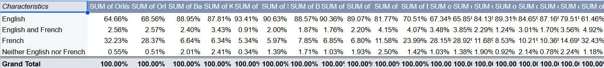
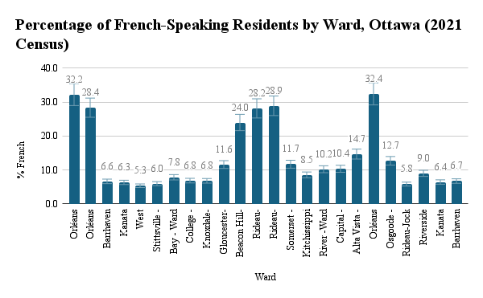
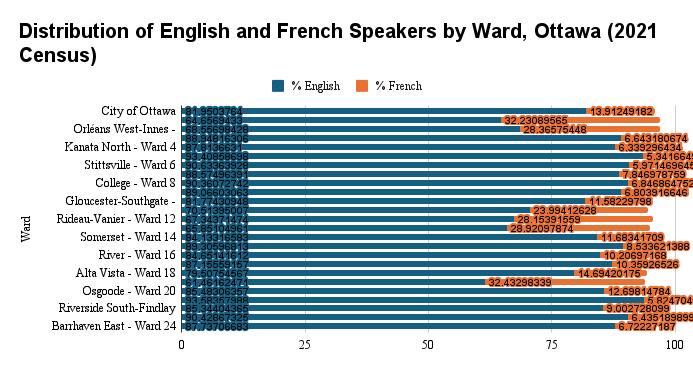

**6 November 2025** 
**CMN4100: Special Issues** 
**Luc Baisley; Claire Forest; Joyce; Naomie** 
**Presented to Jean-Sébastien Marier** 

# Exploratory Data Analysis (EDA) & Pitch
## 1. Introduction

For this exploratory data analysis and pitch, we are to clean and analyse the dataset called 2021 long-form census - ward data (City of Ottawa, 2023), then create visualisations in charts and identify a potential story idea that could emerge from the dataset. There are two versions of this dataset: the long and the short. The long-form dataset was a questionnaire sent to 25% of households, and the short-form dataset was sent to 100% of households. Because one is a census and the other is a survey, the variables available in both have different values. We will be discussing how we obtained our data, how we worked to understand it, and how we identified a potential story within the data. 

The dataset is available on [2021 Long Form Census - Ward Data](https://open.ottawa.ca/datasets/ottawa::2021-long-form-census-ward-data/about), and the CSV version is hosted on the instructor’s [Github portal](https://github.com/jsmarier-courses/jou4100-uottawa-f2025-exploratory-data-analysis-and-pitch-jou4100_jou4500_mpad2003_project2_templa-4)

## 2. Getting Data

The first step we took was downloading our data and importing it into Google Sheets. To do this, we went to the City of Ottawa’s open data portal for the **2021 Long Form Census - Ward Data**. From that point, you should click the button titled “download”, which will download the data in CSV file form onto your computer. Then go to Google Sheets, create a new spreadsheet, click File, then click Import, and choose the CSV you just downloaded. [Here is our data cleaned](https://docs.google.com/spreadsheets/d/1QBEhG0PbpGddCAFMy797ZWpODVEcarKeV_hqneOPJ4s/edit?usp=sharing). 

As we took our first look at the dataset we noticed that with the many rows it had it was a little hard to understand at first there are ``24 columns`` and ``2603 rows`` we noticed that most English-speaking populations lived in the West-end of Ottawa and the French-speaking poupluation lived in the East-end. This one observation aligned with our preexisting assumption as from our prior knowledge of the city we expected that the language divide be geographic, with English centred in the West, and French, in the East. For ``Column A`` had many variables, such as nominal, discrete, and continuous, to name a few, as it had the different characteristics that the population presented, ranging from age, marital status, income, language spoken, etc, ``Column B`` is the city of Ottawa as a whole, and the rest of them are the different neighbourhoods and wards. After the observations we made, we have come to ask the question: **Could official language barriers in each ward affect the French population?** 

*Figure 1: (Above) This shows the first 36 rows and 11 columns of the dataset right after importation

## 3. Understanding Data
### 3.1. VIMO Analysis

Our group conducted a VIMO analysis based on our hypothesis of “Could official language laws in each ward affect the French population?” drawn from our isolated data within the larger dataset from the City of Ottawa’s 2021 long-form Census ward data. Our dataset presents the first official language spoken for the population in private households; English, French, both, or neither, based on the different city wards.

Since the original dataset is from Statistics Canada’s official Census, it ensures a high level of accuracy and reliability. Internally, the data seemed consistent, with the total of each category equaling the Total column for each ward. This consistency affirms that the dataset is accurately representative of the variable used, while also supporting the overall validity of the dataset. As our group first looked over the dataset, we saw no clear invalid entries. However, our group made sure to double-check the totals for each language group, as this is where we viewed the greatest risk of invalid entries. Confirming that the number of individuals from each row did not exceed the total population, and by utilising the Google Sheets `=SUM` formula, we were able to confirm that our first view of the dataset was correct. Along with our own validation, knowing that the dataset came from the City of Ottawa and is based on official census data, not something manually typed by individuals, it is unlikely to have random errors or even made-up values.

`=SUM(B3:B6)`

There were few or no blanks in the dataset, and if there were, they were likely due to unavailable information rather than a mistake. Although these blanks do not significantly change or affect any of our analysis or findings, they should still be noted, especially if any values were to be turned into percentages. Any outliers within the dataset were expected due to Ottawa’s bilingual demographic. While some wards showed higher or lower proportions of French or bilingual speakers, these fluctuations were treated as meaningful rather than abnormal, ensuring that we are viewing them as geographical differences rather than an issue with the data's quality.

From this analysis, we can draw the conclusion that the data is valid, comes from reliable sources, and does not have any major errors, meaning we can confidently use it for the following stages of our analysis.

### 3.2. Cleaning Data

When performing the cleaning data portion of the Exploratory Data Analysis, our team focused this step around the topic of our hypothesis, “Could official language laws in each ward affect the French population?”. The goal of this step was to prepare the data for analysis by ensuring that formatting was consistent and that any new dataset we were creating was structured in a clear and organized way for easier interpretation, not only for our team but for outside readers looking at our results.

The first step performed in this data cleaning process was removing the extra white spaces that were either within or around cell entries. When doing this, we used Google Sheets data cleaning tools; `Data → Data cleanup → Trim whitespace` to clean hidden spaces in the characteristics column. By performing this cleanup step, it ensured consistency if we used filters or formulas later. After performing the trim whitespaces tool, it was evident that the values now appear consistent across all rows, minimizing the possibility of mismatched categories. 

*Figure 2 & 3: (Above) These screen captures show the before and after of the whitespace trimming on the original dataset*

Next, we isolated the data relevant to our hypothesis from the original dataset by creating a new sheet that only consisted of rows and columns specific to “First official language spoken for the population in private households”. This included copying only relevant rows, such as rows 432 to 436, excluding the rest of the unrelated information from the census sheet. This made the dataset easier to manage and prepared it for analysis without unrelated information cluttering the view.

*Figure 4: (Above) This screen captures shows our final isolated dataset*

Finally, we tried to check and remove any duplicates using Google Sheets; `Data → Data cleanup → Remove duplicates`. However, the dataset did not contain any duplicate rows. Although this step turned out not to be required, confirming that there were no duplicates helped establish the dataset’s integrity, in turn aiding in future parts of our analysis.

By trimming whitespace, isolating relevant data, and ensuring there were no duplicates, we made sure that our new data set, “First Official Language Spoken,” was clean, consistent, and ready for future analysis. These steps improved both the readability and the accuracy while keeping the original dataset’s reliability.

### 3.3. Exploratory Data Analysis (EDA)

The main purpose of this exploratory phase was to identify language trends across Ottawa’s 24 wards and determine whether bilingualism appears concentrated in certain regions. Using the **2021 Long Form Census on Ward Data** from the City of Ottawa, we focused on three key variables: the first official language spoken (English, French, English and French, or neither), the ward name, and population counts and percentages per language. These variables directly relate to our guiding question: could official language laws or local bilingual conditions influence the French-speaking population within each ward?

To establish a baseline, I built a pivot table showing the total and proportional breakdown of official-language groups for the entire City of Ottawa. Using the range `A1:Z6` from the “First Official Language Spoken” sheet, I created a new pivot table, added “Characteristics” as rows, and “City of Ottawa” as values summarized by `SUM`. I then displayed the results as “`% of grand total`.” This table (see Figure 1 below) confirmed that English speakers make up roughly four-fifths of Ottawa’s population, French speakers account for about one-seventh, and bilingual residents represent fewer than three per cent. This served as a control for ward-level comparisons.

!

*Figure 5: (Above) This pivot table shows the total and proportional breakdown of official-language groups for the entire City of Ottawa*

To explore local variation, I created a second pivot table (see Figure 2 below) calculating each ward’s percentage of French speakers relative to its total population using the formula `(French / Total) * 100`. This standardized measure allowed for direct comparisons among wards of different sizes. The results showed clear east-west asymmetry: the highest shares of French speakers were found in Orléans South-Navan (32.4%) and Orléans East-Cumberland (32.2%), while the lowest appeared in West Carleton-March (5.3%) and Rideau-Jock (5.8%).

*Figure 6: (Above) This pivot table shows each ward’s percentage of French speakers relative to its total population*

I then visualized these results through two charts in Google Sheets. The first, **Percentage of French-Speaking Residents by Ward**, was a column chart that displayed the proportion of French speakers in each ward (see Figure 3 below). For example, in Orléans East–Cumberland, 15,690 French speakers out of 48,680 residents produced a value of 32.2 per cent. The chart revealed a distinct spatial trend: French-speaking populations are heavily concentrated in the east, particularly near Orléans and the Ottawa-Gatineau corridor, while western suburban wards such as Kanata, Stittsville, and Barrhaven fall below seven per cent.

*Figure 7: (Above) This exploratory chart displays the proportion of French speakers in each ward*

The second visualization, **Distribution of English and French Speakers by Ward**, used a stacked horizontal bar chart to show both groups within each ward (see Figure 4 below). Each bar represented 100 per cent of a ward’s population, split between English and French portions. This layout highlighted the same geographic divide: east-end wards display a more balanced linguistic composition, while most others remain overwhelmingly anglophone. Citywide, English speakers represent roughly 82 per cent of residents and French speakers 14 per cent, consistent with the pivot results.

*Figure 8: (Above) This exploratory chart shows the distribution of English and French speakers by ward*

## 4. Potential Story

Our potential story explores how local language policies and bilingual services could shape where people choose to live in Ottawa. The city has long presented itself as officially bilingual, but the strength and visibility of French services can vary from one ward to another (City of Ottawa, n.d.-a). We want to understand whether wards that offer stronger bilingual services, such as accessible French documentation, signage, or community programming, attract and retain more francophone residents compared to areas where these services are limited.

According to the City of Ottawa’s Bilingualism Policy (City of Ottawa, n.d.-b), all residents should be able to receive municipal services in English or French. However, past research shows that implementation is uneven and often shaped by local demographics and political priorities (Centre de recherche en civilisation canadienne-française, 2018). Data from the City’s 2021 Census Highlights for Ottawa and Region show that French-speaking residents are concentrated in the east end, particularly around Orléans and Vanier (City of Ottawa, 2021). This raises questions about whether city policies and community resources reinforce that pattern over time.

For additional context, the Profile of the Francophone Population in Ontario – 2021 report by the Government of Ontario (2021) shows that Ottawa has one of the province’s largest francophone communities, but growth is uneven across neighbourhoods. Legal disputes such as Canadians for Language Fairness v. Ottawa (City) (Office of the Commissioner of Official Languages, 2023) also highlight how access to French-language services remains a live policy issue.

To tell this story, we would combine census data with interviews from municipal bilingualism officials, representatives of francophone organizations such as La Cité and ACFO Ottawa, and residents from both highly bilingual and predominantly anglophone wards. We would also analyze where French schools, cultural centres, and health or social services are located to assess how local service networks intersect with population patterns. This mixed approach would help link census statistics to real experiences of linguistic access and belonging in the city.

## 5. Conclusion

While the city remains proudly bilingual, the 2021 Census data shows a variation across wards. English dominates in almost every region, while French is mainly in the eastern wards (especially Orléans East-Cumberland and Orléans West-Innes). Central wards like Rideau-Vanier and Rideau-Rockcliffe also show strong francophone representation, highlighting Ottawa’s historical francophone core. In contrast, outer suburban and rural areas such as Barrhaven and Kanata are overwhelmingly anglophone. Some interviews that we thought would be relevant are the  City of Ottawa’s Office of the Bilingualism Policy Coordinator and the Local francophone associations (e.g., La Cité collégiale, Association des communautés francophones d’Ottawa) 

Some challenges we faced were going through the large dataset and trying to find a clear story, it took the most time. Once we found our research question, we were able to focus and work with a smaller section of the data. The biggest lesson we learned is that big datasets can be overwhelming at first, but taking time to explore the information and break it into smaller parts really helps to find meaningful stories.

## 6. References

Bounegru, L., & Gray, J. (Eds.). (2021). *The Data Journalism Handbook 2: Towards A Critical Data Practice*. Amsterdam University Press. [https://ocul-crl.primo.exlibrisgroup.com/permalink/01OCUL_CRL/hgdufh/alma991022890087305153](https://ocul-crl.primo.exlibrisgroup.com/permalink/01OCUL_CRL/hgdufh/alma991022890087305153)

Centre de recherche en civilisation canadienne-française. (2018). The City of Ottawa’s long road to bilingualism. Vie française dans la capitale.
[https://www.viefrancaisecapitale.ca/pouvoir/city_ottawas_long_road_bilinguism-eng](https://www.viefrancaisecapitale.ca/pouvoir/city_ottawas_long_road_bilinguism-eng)

City of Ottawa. (n.d.-a). French language services. City of Ottawa.
[https://ottawa.ca/en/city-hall/creating-equal-inclusive-and-diverse-city/french-language-services](https://ottawa.ca/en/city-hall/creating-equal-inclusive-and-diverse-city/french-language-services)

City of Ottawa. (n.d.-b). Bilingualism policy [Administrative policy]. City of Ottawa.
[https://ottawa.ca/en/city-hall/city-manager-administration-and-policies/policies/administrative-policies](https://ottawa.ca/en/city-hall/city-manager-administration-and-policies/policies/administrative-policies)

City of Ottawa. (2021). Languages: 2021 Census highlights for Ottawa and region. City of Ottawa / Social Planning Council of Ottawa.
[https://2021-census-highlights-for-ottawa-and-region-spc-ottawa.hub.arcgis.com/pages/languages](https://2021-census-highlights-for-ottawa-and-region-spc-ottawa.hub.arcgis.com/pages/languages)

City of Ottawa. (2023, November 22). 2021 Long Form Census – Ward Data [Data set]. Planning, Real Estate and Economic Development Department, Research & Forecasting Branch. Open Data Ottawa. [https://open.ottawa.ca/datasets/ottawa::2021-long-form-census-ward-data/about](https://open.ottawa.ca/datasets/ottawa::2021-long-form-census-ward-data/about)

Statistics Canada. (2020, September 23). Data accuracy and validation: Methods to ensure the quality of data [Video]. Updated November 25, 2021. Statistics Canada. [https://www.statcan.gc.ca/en/wtc/data-literacy/catalogue/892000062020008](https://www.statcan.gc.ca/en/wtc/data-literacy/catalogue/892000062020008)

Government of Canada, S. C. (2022, May 11). Data accuracy and validation: Methods to ensure the quality of data. Government of Canada, Statistics Canada. [https://www.statcan.gc.ca/en/wtc/data-literacy/catalogue/892000062020008](https://www.statcan.gc.ca/en/wtc/data-literacy/catalogue/892000062020008) 

Government of Ontario. (2021). Profile of the Francophone population in Ontario – 2021. Government of Ontario.
[https://www.ontario.ca/page/profile-francophone-population-ontario-2021](https://www.ontario.ca/page/profile-francophone-population-ontario-2021)

Marier, J.-S. (2021, October 9). Cleaning Data in Google Sheets. YouTube. [https://youtu.be/U4yigiawIEU?si=oNA67oGIGaIFeZVr](https://youtu.be/U4yigiawIEU?si=oNA67oGIGaIFeZVr)

Office of the Commissioner of Official Languages. (2023, June 14). Canadians for Language Fairness v. Ottawa (City). Office of the Commissioner of Official Languages.
[https://www.clo-ocol.gc.ca/en/decisions/court-decisions/canadians-language-fairness-v-ottawa-city](https://www.clo-ocol.gc.ca/en/decisions/court-decisions/canadians-language-fairness-v-ottawa-city)
